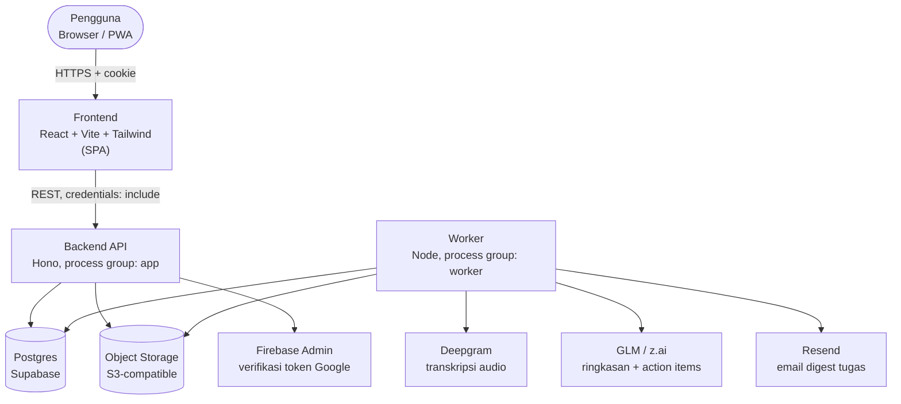
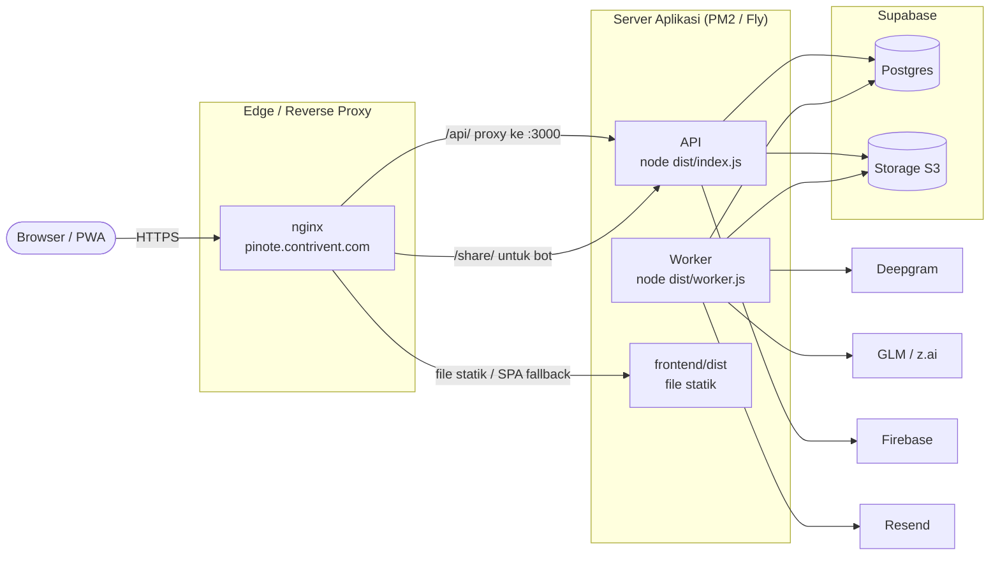
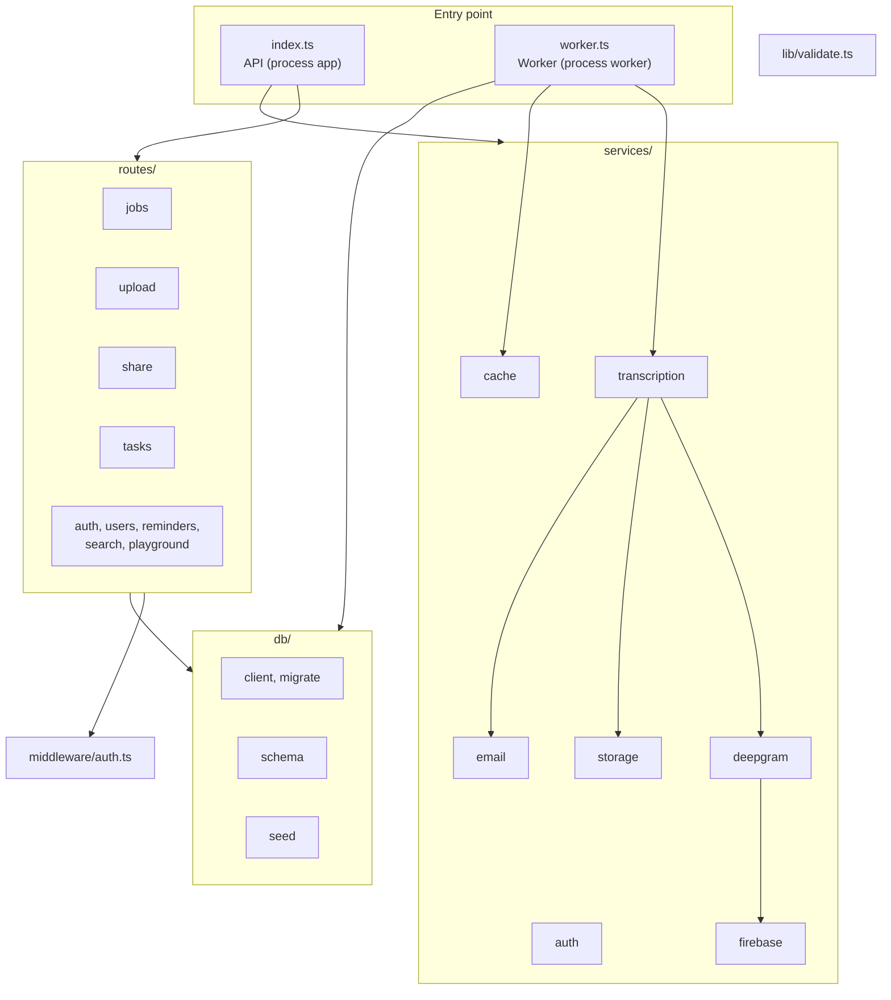
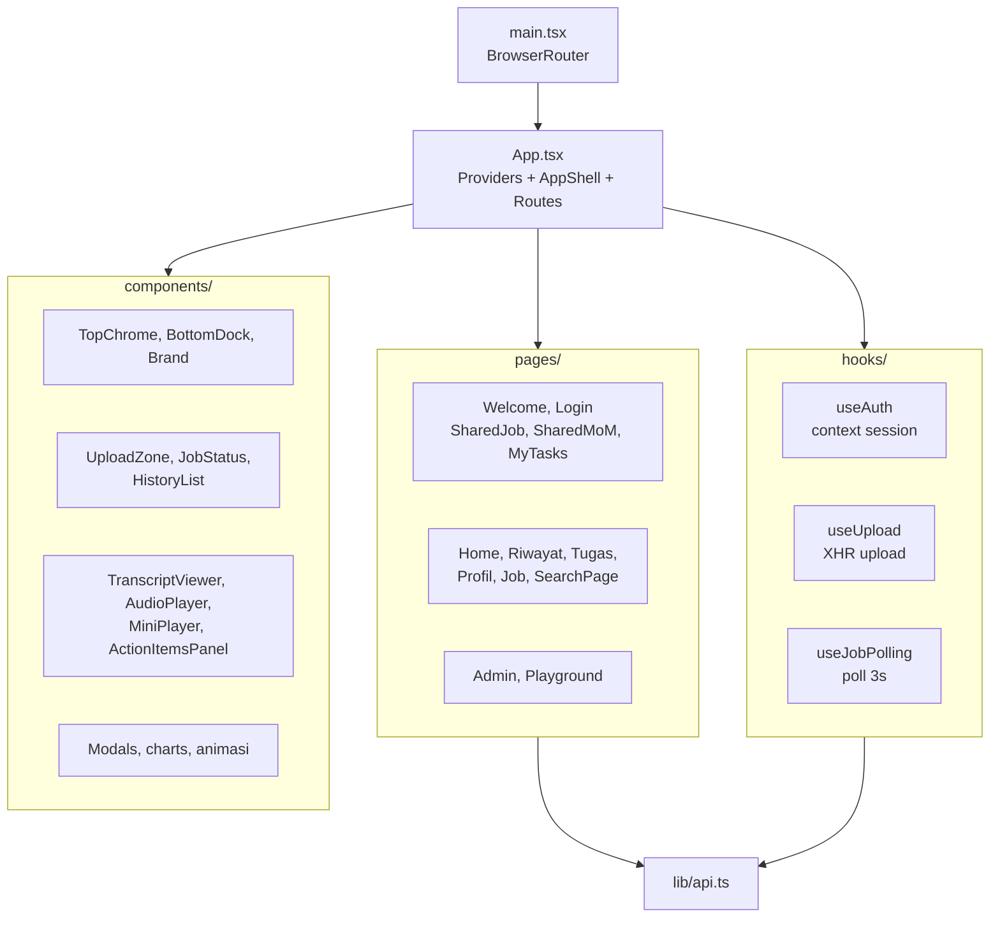
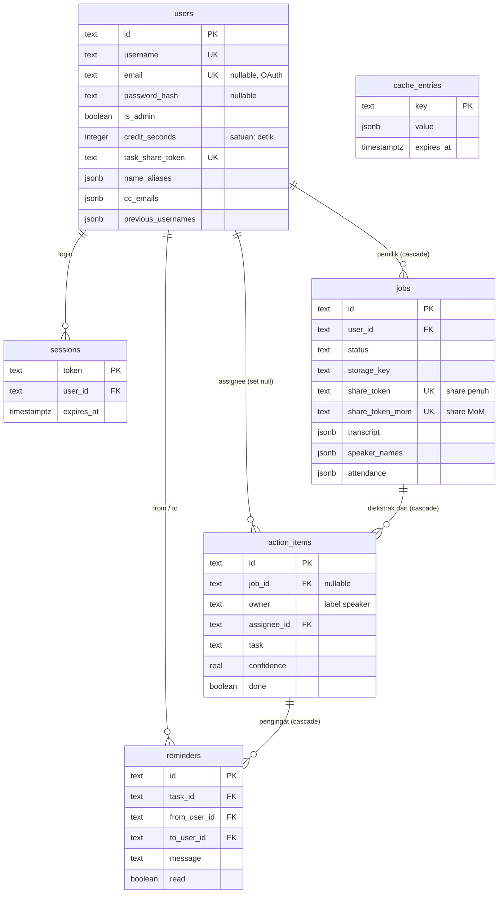
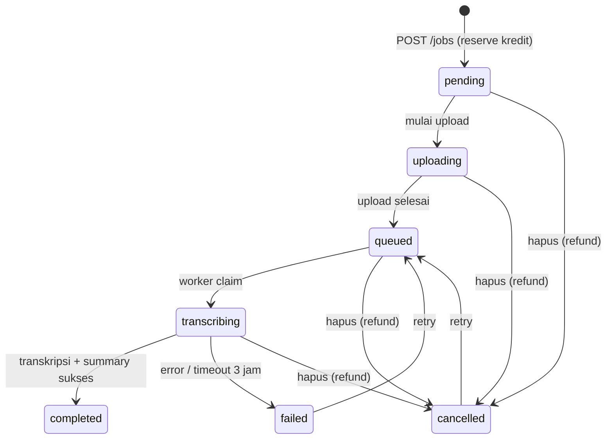
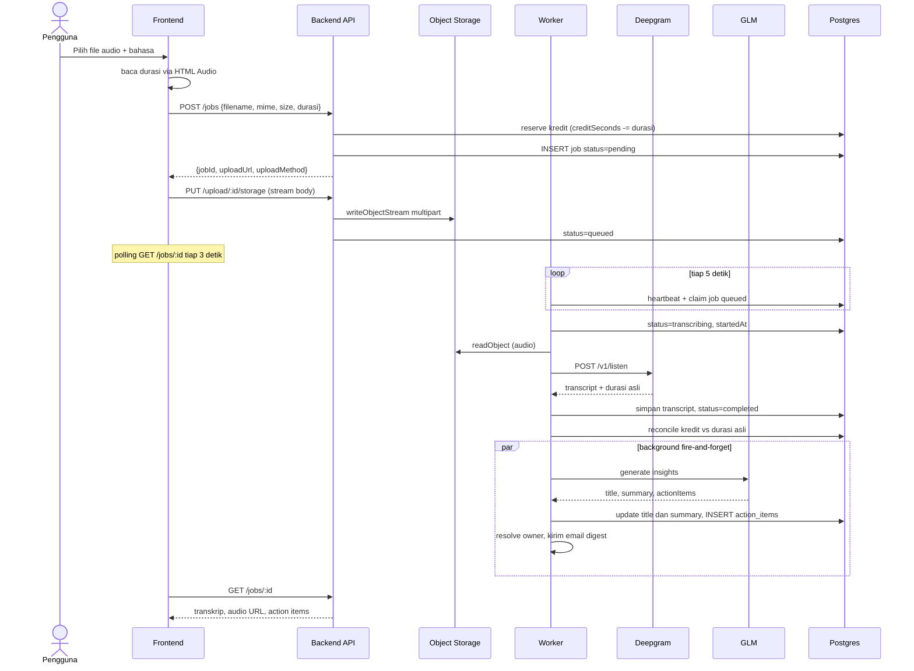
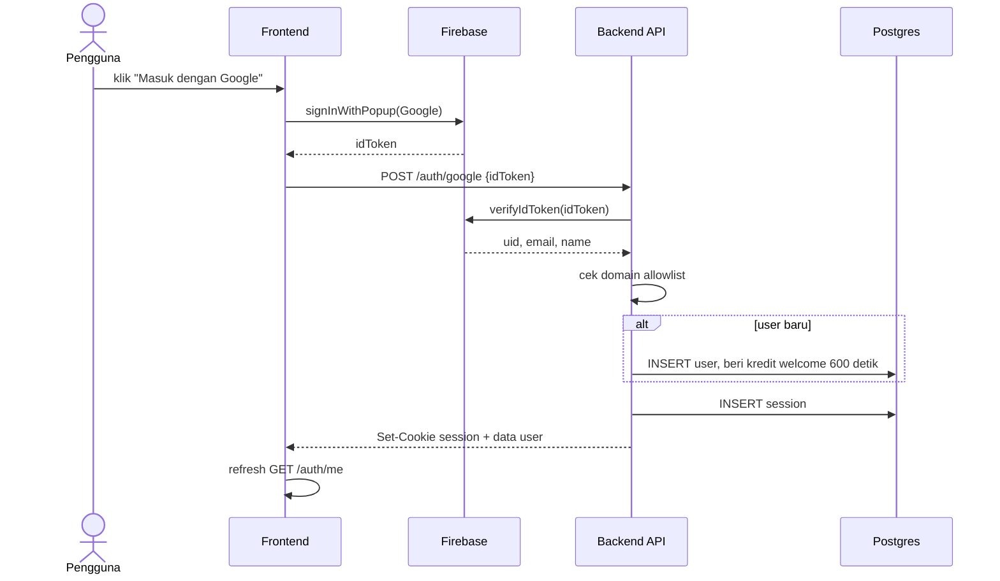
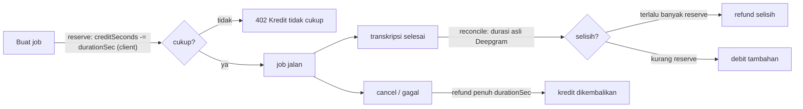
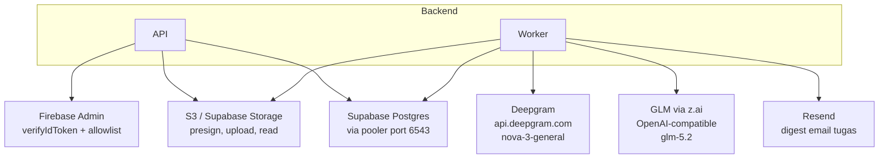

# Arsitektur Pinote (Rekapin)

Dokumen ini menjelaskan arsitektur aplikasi **Pinote by Contrivent**, sebuah generator Minutes-of-Meeting (MoM) yang mengubah rekaman rapat menjadi transkrip, ringkasan, dan daftar action items. Ditulis berdasarkan pembacaan langsung kode di repo, bukan dari asumsi. Kalau ada perbedaan antara dokumen ini dan README atau `.env.example`, yang dipakai sebagai sumber kebenaran adalah kode.

> [!NOTE]
> Penamaan produk agak terbelah di dalam repo. Codebase dan UI internal pakai nama **"Rekapin"** (lihat `package.json` frontend, manifest PWA, dan header `TopChrome`). Halaman share publik dan header `AGENTS.md` masih pakai **"Pinote"**. Dalam dokumen ini dua nama dipakai bergantian mengikuti konteks, tapi yang dimaksud aplikasinya sama.

## Daftar isi

1. [Ringkasan singkat](#1-ringkasan-singkat)
2. [Tech stack](#2-tech-stack)
3. [Gambaran arsitektur](#3-gambaran-arsitektur)
4. [Topologi deployment](#4-topologi-deployment)
5. [Backend](#5-backend)
6. [Frontend](#6-frontend)
7. [Skema database](#7-skema-database)
8. [Siklus hidup job transkripsi](#8-siklus-hidup-job-transkripsi)
9. [Sistem autentikasi](#9-sistem-autentikasi)
10. [Sistem kredit](#10-sistem-kredit)
11. [Sistem share link](#11-sistem-share-link)
12. [Integrasi eksternal](#12-integrasi-eksternal)
13. [Health check dan observability](#13-health-check-dan-observability)
14. [Referensi environment variable](#14-referensi-environment-variable)
15. [Hal-hal yang patut diwaspadai](#15-hal-hal-yang-patut-diwaspadai)

---

## 1. Ringkasan singkat

Pinote menerima file audio rapat, mentranskripsinya lewat Deepgram, lalu memakai GLM (model dari Z.ai) untuk menghasilkan ringkasan dan action items. Pengguna masuk lewat Google Sign-In yang dibatasi domain (`@piranusa.com` atau `@contrivent.com`). Login password dan pendaftaran publik sudah dinonaktifkan di kode.

Ada dua proses yang berjalan terpisah dari satu package `backend` yang sama:

- **API** (`src/index.ts`), framework Hono, melayani REST dan SSR halaman share.
- **Worker** (`worker.ts`), polling database tiap 5 detik untuk mengklaim job dan menjalankan transkripsi.

Antrian job tidak pakai message broker. Worker mengklaim job dengan `UPDATE ... WHERE status='queued'` secara atomik terhadap Postgres. Redis sudah dihilangkan; peran cache, heartbeat worker, dan counter rate-limit dipindahkan ke tabel `cache_entries`.

Frontend adalah SPA React plus PWA, di-deploy terpisah dari backend.

> [!IMPORTANT]
> Jangan mengandalkan README maupun `.env.example` sebagai sumber utama. Beberapa hal di sana sudah tidak cocok dengan kode, misalnya: deployment disebut Vercel padahal ada `netlify.toml` dan config nginx; storage disebut Cloudflare R2 padahal `AGENTS.md` bilang Supabase Storage. Detail lengkap dan versi yang benar ada di bagian [15](#15-hal-hal-yang-patut-diwaspadai).

---

## 2. Tech stack

| Lapisan | Teknologi |
|---|---|
| Frontend | React 18, React Router 6, Vite 6, Tailwind CSS 3, Framer Motion, PWA via `vite-plugin-pwa` |
| Ikon / font | Phosphor Icons, Geist Sans & Geist Mono |
| Backend API | Hono di `@hono/node-server`, Node 20, ESM (`"type": "module"`) |
| Worker | Node standalone (bukan Hono), polling loop |
| ORM & driver | Drizzle ORM + `postgres` (postgres-js), `prepare: false` untuk pooler Supabase |
| Database | Postgres di Supabase |
| Object storage | S3-compatible (Supabase Storage via API S3) |
| Transkripsi | Deepgram (model `nova-3-general`) |
| LLM ringkasan | GLM 4.5 / `glm-5.2` via Z.ai, dipanggil lewat SDK OpenAI |
| Auth | Google Sign-In (Firebase Auth client + firebase-admin verifikasi di server), session cookie |
| Email | Resend (digest tugas) |
| Cache / antrian state | Tabel Postgres `cache_entries` (pengganti Redis) |
| Hosting | Nginx same-origin di VPS (PM2) sebagai deployment kanonik, Fly.io sebagai alternatif container, Netlify sebagai opsi frontend |

> [!TIP]
> Repo tidak punya test runner, lint, ataupun formatter. Cara memverifikasi perubahan adalah dengan build: `npm --prefix backend run build` (jalankan `tsc`) dan `npm --prefix frontend run build`.

---

## 3. Gambaran arsitektur



> **Penjelasan diagram.** Garis menunjukkan arah komunikasi yang benar-benar terjadi di kode. API melayani frontend dan berbicara dengan Postgres, object storage, dan Firebase (untuk verifikasi login Google). API **tidak** memanggil Deepgram ataupun GLM di alur produksi; pemanggilan model AI sepenuhnya dilakukan worker. Worker membaca audio dari storage, mengirim ke Deepgram, meminta ringkasan ke GLM, lalu mengirim digest email lewat Resend. Database adalah sumber kebenaran untuk status job, bukan antrian eksternal.

> [!NOTE]
> Ada satu pengecualian: saat object storage **tidak** diaktifkan (development lokal tanpa S3), API punya jalur in-process di `routes/upload.ts` yang memanggil Deepgram langsung. Jalur ini hanya untuk dev dan tidak dipakai worker. Produksi selalu lewat storage dan worker.

---

## 4. Topologi deployment



> **Penjelasan diagram.** Diagram di atas memetakan deployment same-origin lewat nginx di `pinote.contrivent.com`, yang merupakan setup paling lengkap di repo (lihat `nginx/pinote.contrivent.com.conf` dan `ecosystem.config.json`). nginx menyajikan file statik frontend, mem-proxy `/api/` ke API di port 3000, dan punya logika deteksi bot untuk path `/share/`. Bot crawler diarahkan ke backend agar dapat HTML server-render dengan tag Open Graph, sedangkan browser biasa dapat fallback SPA.

> [!WARNING]
> Dokumentasi di repo tidak konsisten soal hosting. README menyebut frontend di Vercel; ada `netlify.toml`; ada config nginx; dan `fly.toml` mendefinisikan app bernama `pinote-contrivent` di region Singapura (`sin`). Config nginx plus PM2 adalah setup yang paling utuh dan paling mungkin dipakai produksi. Kalau kamu mengubah routing, ingat bahwa logika `/share/:token` untuk bot ada di nginx, bukan di Netlify ataupun Vercel.

**Fly.io** mengelola dua process group dari satu image Docker:

- `app` menjalankan `node dist/index.js`, mendapat traffic HTTP, dengan health check `GET /health`.
- `worker` menjalankan `node dist/worker.js`, tidak menerima HTTP, polling database.

Sebelum tiap deploy, Fly menjalankan `release_command = "node dist/db/migrate.js && node dist/db/seed.js"`. Artinya kode database yang disentuh migrasi dan seed harus ikut ter-compile ke `dist/`.

---

## 5. Backend

Backend adalah satu package `pinote-api` (`backend/package.json`) dengan dua entry point. Berikut struktur direktori `backend/src/`:



### 5.1 Entry point API (`src/index.ts`)

- Memuat `dotenv/config`, lalu memasang global `undici` `Agent` dengan timeout sangat panjang (header dan body 180 menit, connect 30 detik) supaya panggilan Deepgram berdurasi panjang tidak putus.
- Menjalankan server lewat `@hono/node-server` di `PORT` (default 3000), bind `0.0.0.0`.
- Middleware global: `logger()` dan CORS. CORS membaca `ALLOWED_ORIGINS` (comma-separated), mengembalikan origin hanya jika ada di allowlist, dengan `credentials: true` dan `maxAge: 600`.
- Memasang router `/auth`, `/users`, `/jobs`, `/upload`, `/share`, `/tasks`, `/playground`, `/search`, `/reminders`.
- Endpoint health: `/health/live` (selalu 200) dan `/health` (readiness, lihat bagian 13).
- Saat startup menjalankan `recoverStuckJobs()`: semua job `uploading` ditandai `failed` dengan pesan Bahasa *"Server restart saat proses berlangsung. Silakan upload ulang."* Job yang sudah `queued` sengaja tidak disentuh karena jadi tanggung jawab worker.

### 5.2 Entry point worker (`src/worker.ts`)

- Refuses to boot kecuali `STORAGE_PROVIDER=s3`. Tanpa itu, worker throw dan proses mati.
- `workerId` diambil dari `FLY_MACHINE_ID` plus PID; interval polling `WORKER_POLL_MS` (default 5000ms).
- Saat startup: mengembalikan job `transcribing` yang punya `storageKey` menjadi `queued` (pesan *"Worker restart; job re-queued."*).
- Loop utama tiap tick: tulis heartbeat worker (TTL 90s), jalankan `recoverStuckTranscribingJobs()` (di-throttle sekali per 60s; job `transcribing` dengan `startedAt` lebih dari 3 jam dianggap timeout, ditandai `failed` plus refund kredit), lalu klaim satu job `queued` dan proses.

Mekanisme klaim job tidak butuh message broker:

```sql
UPDATE jobs SET status='transcribing', startedAt=now()
WHERE id = ? AND status='queued'
```

Jika baris yang berubah nol, berarti worker lain lebih dulu mengambilnya. Inilah yang membuat beberapa instance worker bisa berjalan aman bersamaan.

### 5.3 Daftar route

| Prefix | File | Auth | Ringkasan |
|---|---|---|---|
| `/auth` | `auth.ts` | campuran | Login Google (`POST /auth/google`), logout, `/me` plus sub-endpoint tugas, statistik, alias nama, cc email, ubah username |
| `/users` | `users.ts` | admin semua | CRUD user, top-up kredit, statistik admin (overview, tren job, top user, biaya, failure terbaru) |
| `/jobs` | `jobs.ts` | auth semua | Buat job, list, detail, audio, retry, share, edit action items, rename speaker, hapus |
| `/upload` | `upload.ts` | auth semua | Proxy upload ke S3 atau finalize direct upload browser |
| `/share` | `share.ts` | publik (token = auth) | SSR HTML halaman share internal dan MoM stakeholder |
| `/tasks` | `tasks.ts` | publik (token) | Daftar tugas seseorang berdasarkan task-share-token |
| `/playground` | `playground.ts` | campuran | Generate tugas dari teks bebas (admin), lihat tugas dan user (publik) |
| `/search` | `search.ts` | auth | Full-text search lintas transkrip user |
| `/reminders` | `reminders.ts` | campuran | Kirim pengingat tugas (admin), lihat dan dismiss reminder (auth) |

> [!IMPORTANT]
> Login password dan pendaftaran publik **sudah ditutup** di kode. `POST /auth/login` dan `POST /auth/register` langsung return 403. Satu-satunya cara masuk adalah `POST /auth/google`. Fungsi hashing password (`bcryptjs`) tetap ada di `services/auth.ts` karena dipakai seeding admin, bukan untuk login user biasa.

### 5.4 Layanan (`services/`)

| File | Tanggung jawab |
|---|---|
| `transcription.ts` | Orkestrasi worker: baca audio dari S3, transkripsi, simpan hasil, reconcile kredit, lalu jalankan ekstraksi insight di background |
| `deepgram.ts` | Inti AI: panggil Deepgram, mengelompokkan kata jadi segmen, polishing transkrip, dan ekstrak title, summary, action items lewat GLM |
| `storage.ts` | Klien S3 (presign URL, upload multipart, baca, hapus, head bucket) |
| `cache.ts` | Pengganti Redis atas tabel `cache_entries` |
| `auth.ts` | Session dan password (hashing, session token, cookie) |
| `firebase.ts` | Verifikasi idToken Google dengan cek domain allowlist |
| `email.ts` | Kirim email via Resend, termasuk digest tugas |

### 5.5 Middleware dan validasi

- `middleware/auth.ts` mendefinisikan `requireAuth` (baca cookie `session`, cari session valid, sisipkan `user` ke konteks) dan `requireAdmin` (tambahan cek `isAdmin`).
- `lib/validate.ts` berisi allowlist MIME audio dan `MAX_FILE_BYTES` (default `MAX_UPLOAD_MB` dikali 1MB), plus `normalizeMime` yang menyatukan alias seperti `audio/x-m4a` menjadi `audio/aac`.

---

## 6. Frontend

Frontend adalah `rekapin-web`, SPA React yang juga PWA. Struktur direktori `frontend/src/`:



### 6.1 Provider dan routing

Pohon provider dari luar ke dalam: `AuthProvider` lalu `ToastProvider`, lalu komponen global (`InstallBanner`, `DebugConsole`) dan `ErrorBoundary` yang membungkus `AppShell`.

`AppShell` hanya menampilkan `TopChrome` dan `BottomDock` untuk user yang sudah login. Rute publik dirender layar penuh tanpa chrome. Semua page di-lazy-load dengan `React.lazy` dan dibungkus `Suspense` plus transisi fade 120ms lewat Framer Motion.

| Rute | Page | Proteksi |
|---|---|---|
| `/` | root (redirect ke `/welcome` atau `Home`) | custom |
| `/welcome`, `/login` | Welcome, Login | publik |
| `/share/:token` | SharedJob | publik (token) |
| `/share/mom/:token` | SharedMoM | publik (token) |
| `/tasks/:token` | MyTasks | publik (token) |
| `/riwayat`, `/tugas`, `/profil`, `/job/:id`, `/search` | masing-masing | `ProtectedRoute` |
| `/admin`, `/admin/playground` | Admin, Playground | `ProtectedRoute` + admin |

`ProtectedRoute` mengarahkan user yang belum login ke `/login` sambil menyimpan tujuan awal di `location.state.from`. Rute `/` punya logika sendiri: belum login ke `/welcome`, sudah login ke `Home`.

### 6.2 Page penting

- **Home**: pusat upload. Menyusun `UploadZone`, `JobStatus`, dan `HistoryList` (limit 3). Menampilkan saldo kredit dalam menit. Punya pull-to-refresh untuk mobile.
- **Job**: page terpadat. Menampilkan transkrip, audio player dengan visualizer Web Audio API, panel action items, dan keyboard shortcut. Menangani state transcribing, failed, cancelled, dan partial transcript saat masih jalan.
- **Tugas**: daftar tugas pribadi. Toggle optimistik, tombol Remind (cooldown 1 jam, handle 429).
- **Admin**: dashboard memuat 6 endpoint paralel, menampilkan grafik dan manajemen user plus top-up kredit.
- **Playground**: admin membuat tugas manual atau generate dari teks bebas lewat GLM.

### 6.3 Hook

- `useAuth`: context yang memanggil `GET /auth/me` saat mount. Mengekspos `user`, `loading`, `login`, `register`, `logout`, `refresh`. Catatan: `login` dan `register` (password) masih ada tapi tidak dipakai UI karena login cuma lewat Google.
- `useUpload`: mengelola state upload (`idle`, `creating`, `uploading`, `queued`, `error`) dengan XHR untuk progress. Membaca durasi audio via `HTMLAudioElement` sebelum membuat job.
- `useJobPolling`: polling `GET /jobs/:id` tiap 3 detik, berhenti saat `failed`, `cancelled`, atau `completed` dengan summary sudah ada.

### 6.4 API client

`lib/api.ts` membungkus fetch dengan `credentials: 'include'` di setiap request. Base URL: `VITE_API_URL` kalau diset, kosong di dev, `/api` di build produksi. Error diparsing ke kelas `ApiError` dengan `status`, `message`, dan `detail`.

> [!WARNING]
> Gotcha development: di dev tanpa `VITE_API_URL`, base URL jadi string kosong sehingga request pergi ke path tanpa prefix (misal `/auth/me`). Proxy Vite hanya menangkap `/api`, jadi request ini tidak kena proxy. Untuk dev yang menyentuh backend, set `VITE_API_URL=http://localhost:3000` di `frontend/.env`.

### 6.5 Komponen unggulan

- **TranscriptViewer**: pencarian dalam transkrip, toggle raw vs polished, unduh TXT dan SRT, audio-follow yang menyorot segmen sesuai waktu audio.
- **AudioPlayer**: player dengan visualizer frekuensi via AnalyserNode, kecepatan putar, dan `audioRef` yang dibagi dengan `TranscriptViewer` serta `MiniPlayer`.
- **ActionItemsPanel**: kelompok per owner, batched `PATCH /jobs/:id/action-items`, rename speaker, threshold confidence `0.55`.
- **BottomDock**: navigasi pill yang polling unread reminder tiap 30 detik dan menampilkan badge merah.

---

## 7. Skema database

Skema didefinisikan di `backend/src/schema.ts` dengan Drizzle ORM. Hanya ada **6 tabel**: `users`, `sessions`, `jobs`, `cache_entries`, `action_items`, `reminders`. Semua ID bertipe `text` (nanoid). Semua timestamp `timestamptz`. Tidak ada tipe enum Postgres; kolom `status` disimpan sebagai `text` dan divalidasi di level aplikasi.



> **Penjelasan diagram.** Relasi inti adalah `users` ke `jobs` ke `action_items`. Hapus user akan cascade ke `sessions`, `jobs`, dan `reminders`, tapi `action_items.assignee_id` hanya di-set null (tugas tetap ada, assignee hilang). Hapus job akan cascade ke `action_items` miliknya. Hapus `action_item` cascade ke `reminders`-nya. Kolom `jobs.transcript` menyimpan seluruh transkrip plus summary sebagai JSONB dalam satu baris, bukan tabel terpisah, sehingga bisa membesar untuk rapat panjang.

### Entitas domain

| Konsep | Lokasi | Catatan |
|---|---|---|
| User | `users` | Satu tabel, OAuth-friendly karena `password_hash` dan `email` nullable |
| Session | `sessions` | Token opaque, FK cascade ke user, TTL 30 hari |
| Kredit | `users.credit_seconds` (integer) | Tidak ada tabel plan atau package. Kredit di-reserve di muka, direconcile worker, di-refund saat batal |
| Job transkripsi | `jobs` | Entitas inti. `status` plus 5 timestamp membentuk lifecycle |
| Penyimpanan file | `jobs.storage_key` | Hanya key di DB, biner di object storage |
| Action items | `action_items` | `owner` adalah label speaker mentah, bisa diresolve ke `assignee_id` |
| Reminder | `reminders` | Pengingat tugas antar user, tabel terbaru |
| Share publik | `jobs.share_token` dan `jobs.share_token_mom` | Dua tingkat: penuh vs MoM saja |
| Share daftar tugas | `users.task_share_token` | Mekanisme terpisah untuk share semua tugas satu user |
| Cache / heartbeat / rate-limit | `cache_entries` | KV generik dengan TTL, pengganti Upstash Redis |

> [!NOTE]
> Ada asimetri penamaan Drizzle: kolom DB `action_items.due_date` dipetakan ke properti TS `due`. Jangan bingung saat membaca kode.

### Evolusi migrasi

Repo punya 10 migrasi (`0000` sampai `0009`), semuanya hasil `drizzle-kit generate`. Beberapa tema yang muncul: pelonggaran constraint untuk mendukung akun OAuth dan tugas tanpa job (migrasi 0004 dan 0005), penambahan domain kolaborasi (`action_items`, `reminders`), model share dua tingkat (0007), dan pengayaan metadata job (`title`, `speaker_names`, `attendance`).

---

## 8. Siklus hidup job transkripsi

Status job adalah union type TypeScript: `pending`, `uploading`, `queued`, `transcribing`, `completed`, `failed`, `cancelled`. State machine-nya:



> **Penjelasan diagram.** Awalnya job berstatus `pending` saat dibuat (kredit sudah di-reserve). Begitu upload dimulai jadi `uploading`, lalu `queued` setelah file sampai di storage. Worker mengklaim dari `queued` ke `transcribing`. Hasil akhir bisa `completed`, `failed` (termasuk timeout 3 jam yang dideteksi worker), atau `cancelled` (refund penuh). Job `failed` dan `cancelled` bisa di-retry kembali ke `queued`. Diagram ini melengkapi `AGENTS.md` yang belum menyebutkan status awal `pending`.

### Alur lengkap upload sampai hasil



> **Penjelasan diagram.** Beberapa hal penting yang sering salah paham. Pertama, kredit di-reserve **di muka** memakai `durationSec` dari client (bukan dari Deepgram), lalu direconcile worker memakai durasi asli Deepgram. Kedua, worker menandai `completed` lebih dulu sebelum insight selesai, supaya user cepat melihat transkrip. Ekstraksi title, summary, dan action items berjalan di background (fire-and-forget, tidak di-await), termasuk kirim email digest ke assignee. Ketiga, tidak ada websocket; frontend hanya polling. Deepgram dipanggil sekali untuk file di bawah `DIRECT_THRESHOLD_SEC` (default 2 jam) agar diarization konsisten; file lebih besar di-chunk pakai ffmpeg.

---

## 9. Sistem autentikasi

Autentikasi memakai **session cookie**, bukan JWT. Token acak 32-byte heksadesimal disimpan di tabel `sessions` (PK `token`, `expiresAt` TTL 30 hari). Sesi kedaluwarsa dihapus saat diakses.



> **Penjelasan diagram.** Frontend memakai Firebase Auth untuk mendapat idToken Google, lalu mengirim ke backend. Backend memverifikasi token via firebase-admin, lalu memeriksa domain email di allowlist `piranusa.com` dan `contrivent.com` (plus `WHITELIST_EMAILS` kalau diset). User baru otomatis dibuat. Cookie dipasang `HttpOnly`; di HTTPS ditambah `Secure` dan `SameSite=None` (wajib untuk request credentialess lintas origin), di dev `SameSite=Lax`. Cookie inilah yang dipakai semua request berikutnya.

> [!IMPORTANT]
> Karena `credentials: 'include'` aktif dan `SameSite=None`, origin di CORS harus cocok persis. Kalau tidak, browser memblokir request. Pastikan `ALLOWED_ORIGINS` mencantumkan frontend yang benar.

---

## 10. Sistem kredit

Kredit adalah integer detik di `users.credit_seconds`. Tidak ada tabel plan atau transaksi terpisah; kolom ini dimutasi langsung.



> **Penjelasan diagram.** Reserve pakai estimasi durasi dari client, reconcile pakai durasi asli dari Deepgram. Kalau estimasi melebihi durasi asli, selisih dikembalikan. Kalau sebaliknya, selisih didebit (dengan floor 0). Karena reserve sudah memotong di awal, batas `MAX_CREDIT_SECONDS` adalah 315.360.000 detik (sekitar 10 tahun). Biaya referensi Deepgram untuk statistik adalah `0.0043` USD per menit.

---

## 11. Sistem share link

Ada dua jenis share yang berdiri sendiri pada baris `jobs` yang sama:

| Jenis | Kolom | URL | Isi |
|---|---|---|---|
| Internal | `share_token` | `/share/:token` | transkrip, audio, summary, action items |
| Stakeholder MoM | `share_token_mom` | `/share/mom/:token` | hanya summary dan action items |

Keduanya adalah token `nanoid(32)` yang independen. Token stakeholder **tidak bisa** dipromosikan jadi token internal; endpoint audio menolak token MoM. Halaman share di-render server-side sebagai HTML oleh backend (`share.ts`) supaya crawler dapat tag Open Graph, dan bisa juga diminta sebagai JSON.

Selain itu ada mekanisme terpisah untuk membagikan **semua tugas** satu user lewat `users.task_share_token` di path `/tasks/:token`.

> [!TIP]
> Saat mengubah routing, ingat bahwa path `/share/:token` punya dua konsumen: crawler yang butuh HTML SSR dari backend, dan browser yang butuh SPA. nginx sudah menangani ini dengan deteksi user-agent. Kalau pindah ke host lain, logika ini harus dipindahkan juga.

---

## 12. Integrasi eksternal



> **Penjelasan diagram.** Hanya worker yang berbicara dengan model AI dan Resend. API hanya menyentuh Firebase (verifikasi login), storage (presign dan proxy upload), dan database. Deepgram dipanggil dengan diarization, punctuation, dan smart format aktif, plus keyterm boosting dari daftar nama user di database. GLM dipakai dua hal: polishing transkrip (opsional, saat `TRANSCRIPT_POLISH=1`) dan ekstraksi insight (title, summary, action items) dengan `temperature: 0.2` dan output JSON.

Detail koneksi database: `DATABASE_URL` memakai pooler Supabase di port 6543 dengan `prepare: false`, konfigurasi wajib agar driver postgres-js kompatibel dengan pooler transaction-mode.

---

## 13. Health check dan observability

| Endpoint | Perilaku |
|---|---|
| `GET /health/live` | Liveness, selalu 200, tidak cek subsistem |
| `GET /health` | Readiness, 200 kalau semua sehat, 503 kalau ada yang gagal |

`/health` mengecek empat subsistem (masing-masing dibungkus timeout 5 detik):

- **db**: `SELECT 1` lewat Drizzle.
- **cache**: round-trip tulis lalu baca kunci `health:cache` di tabel `cache_entries`.
- **storage**: `HeadBucket` S3, hanya dijalankan saat `STORAGE_PROVIDER=s3`.
- **worker**: baca heartbeat worker; sehat kalau heartbeat ada dan usianya di bawah 90 detik. Hanya dicek saat storage aktif.

> [!NOTE]
> Nama field di respons adalah `cache`, bukan `redis`. Di deployment tanpa storage (dev lokal), `storage` dan `worker` default `true` (di-skip).

Selain health, ada beberapa mekanisme pemulihan otomatis: API menandai job `uploading` sebagai `failed` saat restart; worker menandai job `transcribing` lebih dari 3 jam sebagai `failed` plus refund; worker juga mengembalikan job `transcribing` yang punya `storageKey` ke `queued` saat restart worker.

---

## 14. Referensi environment variable

Hanya variable yang **benar-benar dibaca kode** yang didokumentasikan di sini. Beberapa nama seperti `JWT_SECRET`, `COOKIE_SECRET`, `REDIS_URL`, `UPSTASH_REDIS_REST_URL` muncul di `.env.example` tapi tidak dipakai kode saat ini.

### Backend

| Variable | Default | Kegunaan |
|---|---|---|
| `NODE_ENV` | | Mode environment, mempengaruhi cookie secure dan validasi seed |
| `PORT` | 3000 | Port API |
| `HOST` | 0.0.0.0 | Bind host API |
| `ALLOWED_ORIGINS` | `http://localhost:5173` | Daftar origin CORS yang diizinkan (comma-separated) |
| `MAX_UPLOAD_MB` | 100 | Batas ukuran upload |
| `DATABASE_URL` | | Connection string Postgres pooler (port 6543) |
| `STORAGE_PROVIDER` | | Harus `s3` untuk mengaktifkan object storage dan worker |
| `S3_ENDPOINT`, `S3_REGION`, `S3_BUCKET` | `auto` | Konfigurasi endpoint S3 |
| `S3_ACCESS_KEY_ID`, `S3_SECRET_ACCESS_KEY` | | Kredensial S3 |
| `S3_FORCE_PATH_STYLE` | true (kecuali `false`) | Path style S3 |
| `S3_SIGNED_URL_TTL_SEC` | 900 | TTL presigned URL |
| `BROWSER_DIRECT_UPLOAD` | false | Upload langsung browser ke S3 kalau `true` |
| `WORKER_POLL_MS` | 5000 | Interval polling worker |
| `DEEPGRAM_API_KEY` | | Kunci Deepgram |
| `DEEPGRAM_MODEL` | `nova-3-general` | Model transkripsi |
| `DEEPGRAM_KEYWORDS`, `DEEPGRAM_MAX_KEYTERMS` | 50 | Keyword boosting |
| `DEEPGRAM_MAX_RETRIES` | 3 | Retry transient error |
| `DIRECT_THRESHOLD_SEC`, `CHUNK_DURATION_SEC` | 7200, 1800 | Threshold single-call dan durasi chunk |
| `TRANSCRIPT_POLISH` | off | Aktifkan polishing GLM saat `1` |
| `GLM_API_KEY` | | Kunci GLM |
| `GLM_BASE_URL` | `https://api.z.ai/api/paas/v4` | Base URL OpenAI-compatible |
| `GLM_MODEL` | `glm-5.2` | Model ringkasan |
| `FIREBASE_PROJECT_ID`, `FIREBASE_CLIENT_EMAIL`, `FIREBASE_PRIVATE_KEY` | | Inisialisasi firebase-admin |
| `WHITELIST_EMAILS` | | Email tambahan di luar domain allowlist (CSV) |
| `RESEND_API_KEY`, `EMAIL_FROM` | `Pinote <noreply@contrivent.com>` | Konfigurasi email |
| `DEFAULT_ADMIN_USERNAME`, `DEFAULT_ADMIN_PASSWORD` | `yoel`, `123` | Seeding admin; wajib minimal 8 karakter di staging dan produksi |
| `ALLOW_PUBLIC_SIGNUP` | | Flag status signup (endpoint signup tetap 403) |
| `SIGNUP_CREDIT_SECONDS` | 600 | Kredit welcome user baru |
| `FLY_MACHINE_ID` | | Sumber workerId di Fly |

### Frontend (hanya `VITE_*` yang terekspos)

| Variable | Default | Kegunaan |
|---|---|---|
| `VITE_API_URL` | kosong di dev, `/api` di build produksi | Base URL API |
| `VITE_MAX_UPLOAD_MB` | 100 | Batas ukuran upload di sisi UI |
| `VITE_FIREBASE_API_KEY`, `VITE_FIREBASE_AUTH_DOMAIN`, `VITE_FIREBASE_PROJECT_ID` | | Inisialisasi Firebase Auth |

> [!WARNING]
> Supabase Storage memakai API S3 di `https://[ref].supabase.co/storage/v1/s3` dengan `S3_FORCE_PATH_STYLE=false`. Kredensial S3 didapat dari Project Settings, Storage, S3 Connection, bukan dari service-role key Supabase standar.

---

## 15. Hal-hal yang patut diwaspadai

Beberapa ketidakcocokan antara dokumentasi yang ada dan kode. Yang berlaku adalah kode.

1. **Hosting ambigu.** README bilang Vercel; ada `netlify.toml`; ada config nginx plus `ecosystem.config.json`; dan `fly.toml` punya app `pinote-contrivent`. Setup nginx same-origin adalah yang paling utuh dan paling mungkin produksi.
2. **Provider storage ambigu.** `.env.example` menulis contoh Cloudflare R2 dengan path style true, sedangkan `AGENTS.md` menulis Supabase Storage dengan path style false. Kode provider-agnostic, jadi dua-duanya bisa jalan; yang benar tergantung deployment.
3. **Nama app Fly** di `fly.toml` (`pinote-contrivent`) berbeda dengan contoh deploy di README (`taskit-contrivent`).
4. **Auth.** Login password dan signup publik sudah 403. Yang aktif hanya Google Sign-In dengan allowlist domain. Jangan mengasumsikan ada login password.
5. **Status job.** Termasuk status awal `pending` yang tidak disebut `AGENTS.md` di baris lifecycle-nya.
6. **Routing `/share/:token`** untuk bot ditangani nginx, bukan rewrite Netlify ataupun Vercel.
7. **`speaker-service/`** hanya berisi virtualenv Python tanpa source maupun wiring ke kode. Kemungkinan eksperimen speaker identification yang sudah tidak aktif. Jangan menganggapnya bagian dari runtime.
8. **Toolchain.** Pakai `npm`, bukan `pnpm`, meski ada `pnpm-lock.yaml` usang di root. Tiap app punya `package-lock.json` sendiri. Tidak ada `npm test` maupun `npm run lint`.
9. **ESM import specifier.** Karena `moduleResolution: Bundler` plus runtime ESM, file TS backend wajib pakai ekstensi `.js` eksplisit di import (misal `./routes/auth.js`). Ikuti gaya ini di file baru.
10. **Cache PWA.** Catatan lama soal origin API yang di-hardcode di runtime cache `vite-plugin-pwa` sudah basi untuk versi ini; `runtimeCaching` di `vite.config.ts` sekarang kosong.
11. **Branding.** "Rekapin" untuk UI internal, "Pinote" untuk halaman share publik dan `AGENTS.md`, URL OG di `index.html` bahkan menyebut `rekapin.app`. Perlu disatukan kalau mau konsisten.

---

*Dokumen ini dibuat dari pembacaan kode pada tanggal 7 Agustus 2026. Verifikasi ulang ke kode kalau ada perubahan besar.*
